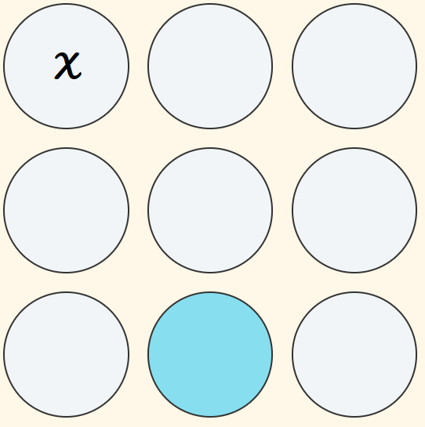
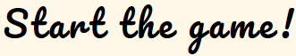
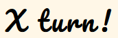

# TIC-TAC-TOE
This is a well known Tic Tac Toe game, just in a new shape! Not every time we have a paper and a pen in our pockets, but we always will have our mobile phones.  Long wait for a bus? Kids getting bored? Why not to play a [TIC TAC TOE](https://kristine-kiki.github.io/Tic-Tac-Toe/) game? This game has been designed mainly for kids, but I believe every adult still have a small kid inside.   As you can see the game has been designed for a big varaty of devices to be navigated freely and efficiently. 

## Features
<ul><li><strong>Header</strong></li>  
As you can see, on the top of the page is the name of the game in a playful font for kids more to like. It is clear to read and understand.  
  
<li><strong>The Game</strong></li>  
<ul><li>Layout of the game is changed to make it more interesting and playful from classic Tic Tac Toe games with a grid of squeres. Circle changes the colour and indicates which field player wants to mark </li> 
   
<li>Status section under the game shows to start the game. After the game is started it shows which player does the next move  
 <inline></inline>

</ul>
## Body

## Testing
There are four sections in the page:
<ul><li><strong>Our Story</strong></li>
Provides inspiration and explains the purpose of the website
<li><strong>Workshop</strong></li>
Describes the benefits of joining IIWII.
<li><strong>Contact</strong></li>
Allows visitors to sign up for updates and information on candle-making.
<li><strong>Sign Up!</strong></li>
Sign up section to recieve newest updates and information about how to make candles 
