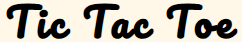
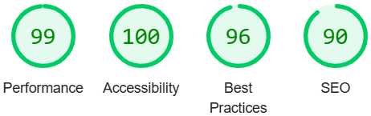
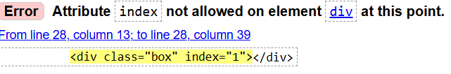

# TIC-TAC-TOE
This is a well-known Tic Tac Toe game, but with a new twist! We may not always have paper and pen handy, but we always have our mobile phones.  Long wait for a bus? Kids getting bored? Why not play a quick game of [TIC TAC TOE](https://kristine-kiki.github.io/Tic-Tac-Toe/) game? This game is designed primarily for kids, but it's also perfect for anyone who enjoys a fun, casual game   The game is optimized for a wide range of devices, ensuring smooth and efficient navigation..  

## Features
<ul><li><strong>Header</strong></li>  
At the top of the page, you'll find the game title in a playful, kid-friendly font that is easy to read and understand.  
  
<li><strong>The Game</strong>   
<ul><li>The layout of the game has been redesigned to make it more interesting and engaging compared to classic Tic Tac Toe games with a simple grid of squares. A circle changes color to indicate which field a player wants to mark. </li> 
   
<li>The status section below the game area displays instructions to start the game.   
   
<li>Once the game begins, it shows which player's turn it is. Players take turns marking empty fields with their designated symbol.  
</ul>  
<li><strong>Score area</strong></li> 
<ul><li>When the game ends, the winner is announced below the game area with messages like "X won!", "O won!" or "You Both won!"</li>  
   <li>Scores are updated accordingly, showing which player has won under the winning message.</li> 

</ul>
<li><strong>Reset button</strong></li> 
The reset button allows players to restart the game for the next round.   
 </ul>
<ul><li><strong>Footer</strong></li>  
The footer includes the rules for how to play the game. </ul> 
  

<italic>A feature i would like to add - a crossing line appears when a player completes a row, column, or diagonal with three of the same marks, highlighting the winning combination and adding excitement to the game.</italic>

## Testing

<ul><li><strong>W3C HTML Validator</strong></li>
No Errors or Warnings to show
<li><strong>W3C CSS Validator (Jigsaw)</strong></li>
No Errors found.
<li><strong>JSHint JavaScript Validator</strong></li>
No Errors or Warnings found.
<li><strong>Lighthouse</strong></li> 
</ul>

## Bugs
While I was validating code with the W3C HTML Validator, I got 9 error messages   
   
Code fixed by changing attribute`s name to <strong>data-index</strong>. 

## Deployment
Web page was created by using Github.Created new repository as per instructions. I was using "git add . " for adding the files and "git commit -m" to commit changes i was making, "git push" was used to push changes to repository on Github. Github repository-Settings-Branch-chainged to "main"-Saved. System provided live link to [TIC TAC TOE](https://kristine-kiki.github.io/Tic-Tac-Toe/)

## Credits
<ul><li>Code for the Score-area copied from Love Maths project</li>
<li>The rules of the game were copied from Google</li>
<li>A big thank you to Code Institute's student <strong>Ioan Zaharia</strong> (https://github.com/zioan) for his excellent support and quick replies in the Slack community.
</ul>
